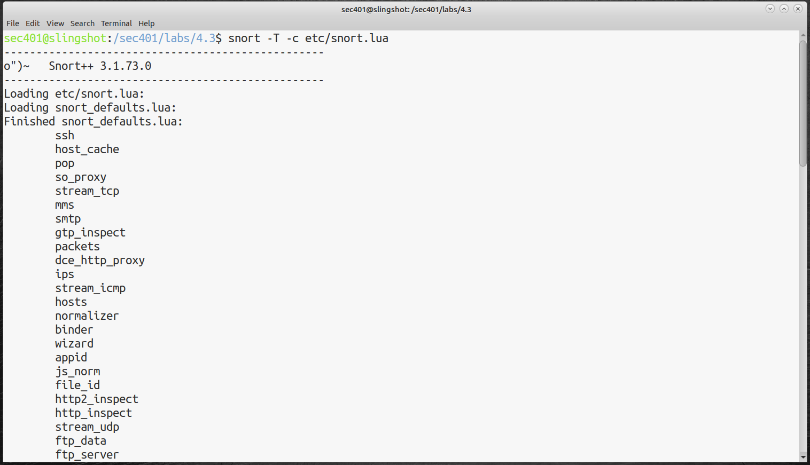
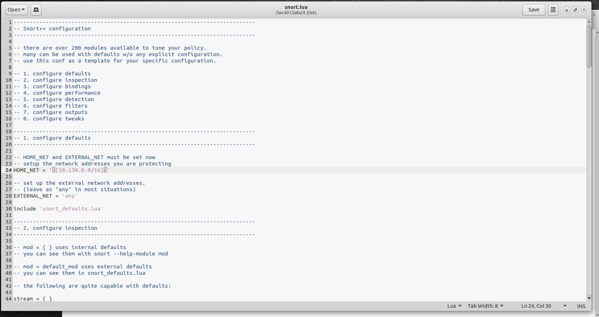
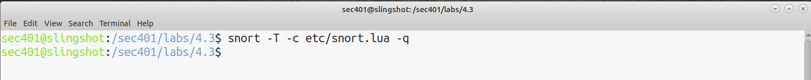
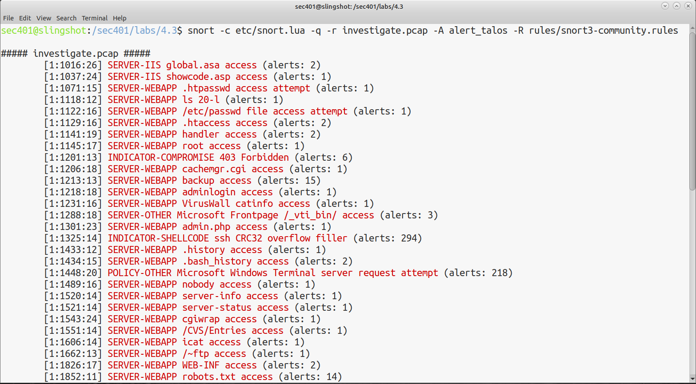
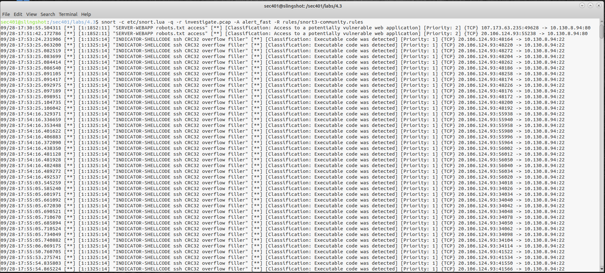
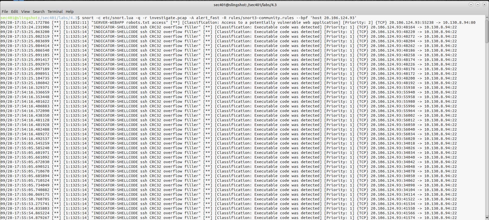
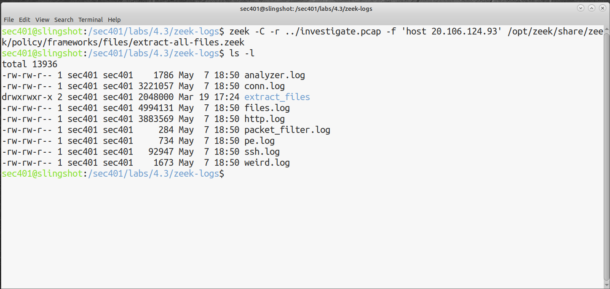
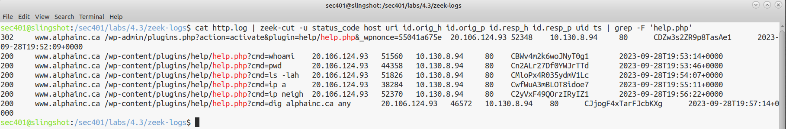

# Lab-4.3-Snort3-and-Zeek

## Overview:

When dealing with network intrusions, prevention is the most ideal. However, detection is a must. To quote the course instructor, Bryan Simon, “timely detection leads to a timely response”. In this lab, I ran two intrusion detection systems (IDS) / network security monitors (NSM) against the network packet capture file (PCAP) from the compromised web server. I explore Snort3’s signature-based detection and Zeek’s log correlation and behavioural based hunting abilities. 

## 1: Snort3 Configuration

I ran the Snort in test mode to confirm the provided configuration file loads without errors. The output shows the version 3.1.73.0 enumerating every compiled-in inspector: HTTP, HTTP2, TLS/SSL, SMTP, SSH, FTP, DCE-RPC variants, DNS, IEC104, Modbus, NetFlow, port_scan, the wizard (protocol auto-id), and stream reassembly for TCP/UDP/ICMP.

## 2: Defining HOME_NET

As a best practice, I defined the HOME_NET variable using gedit to be the CIDR network 10.130.0.0/16. This variable represents the internal network that is to be monitored. 

## 3: Validation

I tested the configuration again (suppressing startup noise) to validate the variable change. No output means no errors. 

## 4: Inspecting the PCAP

I ran the investigate.pcap file through Snort with the community rules and the alert mode set to alert_talos (human-readable). The output is grouped by Signature ID (SID), and shows signs of web reconnaissance, vulnerability scanning, and exploit attempts against the SSH service (294 alerts).

## 5: Alert_fast mode

Switching the output to alert_fast mode for one-line-per-alert in brief text format, clearly shows the SSH buffer overflow exploit attempts, and every alert traces back to the attacker’s IP: 20.106.124.93. 

## 6: BPF Filters

I added the BPF filter ‘host 20.106.124.93’ to filter for the attacker’s IP. There was still a lot of alert messages, but some of the other noise was cut down. 

## 7: Generating Zeek Logs

To provide context and further analysis of the network traffic, I used Zeek with the extract-all-files policy. Zeek can tell the analyst who communicated, when, what protocol, what files were transferred and more. 

## 8: Parsing the http.log with zeek-cut

From a http alert identified with Snort, I investigated the http.log, used zeek-cut to parse the log data, and used grep to find the alert (an http request being made to a wordpress plugin called help.php). The output shows redirect and success code (302/200), and commands that clearly show the attacker enumerating the web server. 

## Takeaways:

Snort and Zeek are both powerful tools, but serve different purposes. Snort is used for intrusion detection, Zeek is used for traffic analysis, and they should be deployed together, not one or the other. They complement each other. 

It was interesting to not only see the vast number of alerts an IDS can generate, but also to take those alerts and follow the network activity in detail and find actual evidence. Using both as an analyst would be helpful from going from “the IDS generated an alert” to “here’s how the attacker generated the alert and what they did next”. 

